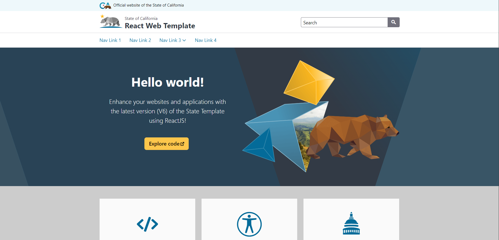

# California-State-Web-Template-react
This is the simple and lightweight California State Web Template version using the ReactJS framework.

## Get Started
Quickly begin development with three easy steps:
<ol>
<li>Clone the repository to your local machine.</li>

<li>Run <code>npm install</code> from the command line.</li>
<li>Run <code>npm start</code> from the command line.</li>
</ol>

You should now see the "Hello world!" example page running on localhost:3000

## View Examples

Check out examples of each State Template React element here: https://office-of-digital-services.github.io/California-State-Web-Template-react/

